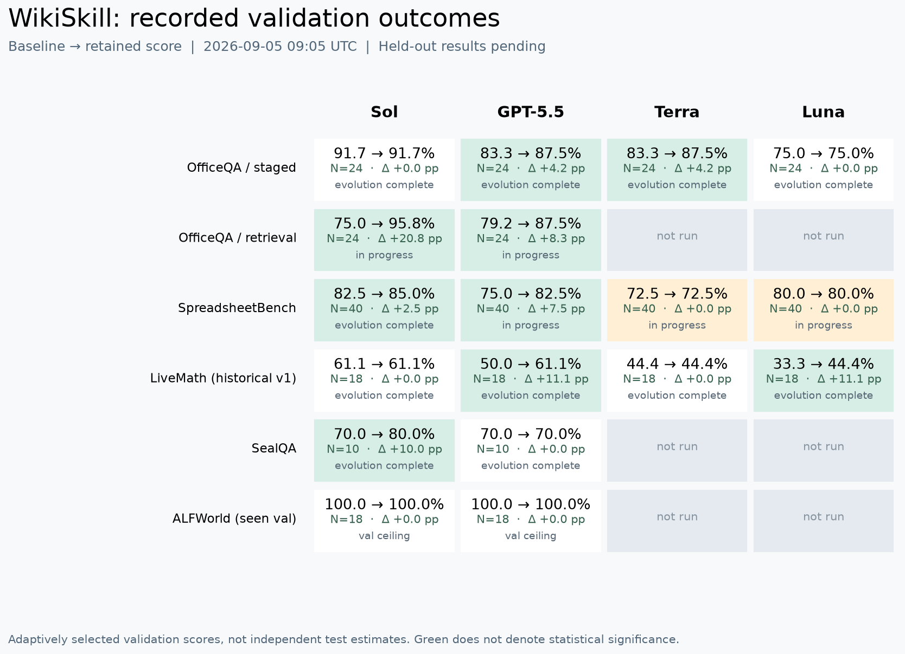

# Recorded validation results

Snapshot: 2026-09-05T09:05:56.639080+00:00

Scores are re-computable with `wikiskill results`. They are historical validation selection scores, not independent held-out results. The snapshot contains 12 ACCEPT events across 9 distinct domain-model configurations.

| Domain | Model | N | S0 | Retained | Delta (pp) | Status |
|---|---|---:|---:|---:|---:|---|
| officeqa | sol | 24 | 0.9167 | 0.9167 | +0.00 | complete_k4 |
| officeqa | 55 | 24 | 0.8333 | 0.8750 | +4.17 | complete_k4 |
| officeqa | terra | 24 | 0.8333 | 0.8750 | +4.17 | complete_k4 |
| officeqa | luna | 24 | 0.7500 | 0.7500 | +0.00 | complete_k4 |
| officeqa-retrieval | sol | 24 | 0.7500 | 0.9583 | +20.83 | evolution_pending |
| officeqa-retrieval | 55 | 24 | 0.7917 | 0.8750 | +8.33 | evolution_pending |
| officeqa-retrieval | terra | 24 | — | — | — | not_run |
| officeqa-retrieval | luna | 24 | — | — | — | not_run |
| livemath | sol | 18 | 0.6111 | 0.6111 | +0.00 | complete_k4 |
| livemath | 55 | 18 | 0.5000 | 0.6111 | +11.11 | complete_k4 |
| livemath | terra | 18 | 0.4444 | 0.4444 | +0.00 | complete_k4 |
| livemath | luna | 18 | 0.3333 | 0.4444 | +11.11 | complete_k4 |
| spreadsheet | sol | 40 | 0.8250 | 0.8500 | +2.50 | complete_k4 |
| spreadsheet | 55 | 40 | 0.7500 | 0.8250 | +7.50 | evolution_pending |
| spreadsheet | terra | 40 | 0.7250 | 0.7250 | +0.00 | evolution_pending |
| spreadsheet | luna | 40 | 0.8000 | 0.8000 | +0.00 | evolution_pending |
| sealqa | sol | 10 | 0.7000 | 0.8000 | +10.00 | complete_k4 |
| sealqa | 55 | 10 | 0.7000 | 0.7000 | +0.00 | complete_k4 |
| sealqa | terra | 10 | — | — | — | not_run |
| sealqa | luna | 10 | — | — | — | not_run |
| alfworld | sol | 18 | 1.0000 | 1.0000 | +0.00 | early_stop_val_ceiling |
| alfworld | 55 | 18 | 1.0000 | 1.0000 | +0.00 | early_stop_val_ceiling |
| alfworld | terra | 18 | — | — | — | not_run |
| alfworld | luna | 18 | — | — | — | not_run |

`evolution_pending` includes queued or unfinished arms; a retained S0 in these rows is not a completed zero-effect result. `not_run` cells are not counted as negative results. Historical LiveMath v1 contains the known upstream shortcut artifact.

## Recompute and extend

The packaged `resources/research/snapshot.json` includes paired UID scores, selected skill hashes and historical gate metadata. Missing model echoes remain null. `scripts/import_snapshot.py --source <origin-checkout> --output <new-directory>` produces a new allowlisted snapshot and refuses overwrite. No restricted CSV, gold answers, model answers or full trajectories are distributed.

Historical gate entries include infrastructure attempts and superseded outcomes; they are not all independent rounds. Complete source attempts remain in the operator archive.

## OfficeQA cross-model transfer pilot

Staged-document val, N=24 per cell, one run. These six transfers show mixed or unchanged outcomes, not established positive transfer. No LiveMath transfer result is implied.

| Skill source | Target | S0 | With skill | Delta (pp) |
|---|---|---:|---:|---:|
| Terra | Luna | 18/24 | 18/24 | 0 |
| Terra | GPT-5.5 | 20/24 | 20/24 | 0 |
| Terra | Sol | 22/24 | 21/24 | -4.17 |
| GPT-5.5 | Luna | 18/24 | 19/24 | +4.17 |
| GPT-5.5 | Terra | 20/24 | 19/24 | -4.17 |
| GPT-5.5 | Sol | 22/24 | 21/24 | -4.17 |

These descriptive pilot aggregates are transcribed from the source study, separate from the packaged evolution-pair verifier. Independent generalization work is ongoing. See [limitations](limitations.md).
